  

# Potato-1

Potato-1 is part of a Brainfuck CPU. It is only the control logic, i.e. you have to bring your own registers, memory controller and io logic. It is very simple, hence likely very slow: You could probably run your brainfuck code on a potato and it would be equally fast, hence the name. The project picture was generated using DALL·E. Potato-1 is a project submitted to TinyTapeout to be fabricate as an ASIC.

## Overview

Potato-1 is a control unit, which processes 4bit instructions and controls CPU registers accordingly. It is designed in a very simple and minimalistic way, i.e. there is only the bare minimum to execute brainfuck code. Most commands are straight forward and can be passed through as they are, i.e. increment/decrement value and data pointer, put and get value.

### Architecture

Loops requiere some logic is, but there is no stack, neither are there jumps or labels to jump to. Insteady the code is executed in reverse direction to execute loops. To find the matching '[' or ']' a 16bit counter is used. Each loop instruction will increment or decrement the counter accordingly. If we skip from start to end or end to start, the target value is stored in another register. If both values match, the execution continous. As there is no jump instruction, the programm is executed one instruction at a time, but if the CU 'jumps' intermediate instructions are ignored. If the 'jump' is from end to start, the execution direction is reversed, i.e. the program counter is decrement until the matching loop instruction is found.

Read an write instructions relay on some external IO logic, which puts the value to some kind of IO or gets a value from there. IO indicates that it is no yet done with the IO-Wait pin.

Input Signals:
| Pin | Signal | Description |
| --- | ------ | - |
| 0 | Clock | |
| 1 | Reset_n | active low |
| 2 | IO Wait | wait till Put/Get from/to value is done |
| 3 | Zero Flag | indicate that value is zero |
| 4-7 | Instruction | 4bit instruction |

Each rising edge the CU will read in the instruction, zero flag and IO Wait flag and process it. Each falling edge the output pins will be updated. The output pins indiciate which action to take, i.e. which registers to increment/decrement. If Put or Get pin is set, the CU will pause execution until IO Wait is unset. If IO Wait is already unset, the CU will immidiatly execute the next command without waiting.

Output Signals
| Pin | Signal | Description |
| --- | ------ | - |
| 0 | PC++ | increment program counter |
| 1 | PC-- | decrement program counter
| 2 | X++ | increment data pointer
| 3 | X-- | decrement data pointer
| 4 | A++ | increment value
| 5 | A-- | decrement value
| 6 | Put | write value
| 7 | Get | read value

### Instructions

Additionaly to the 8 original brainfuck instructions there is a HALT instruction to stop execution and a NOP instructions to do nothing, also there are unused instruction (some of them may be used to extend the instruction set in a later itteration).

Commands:
| Opcode | Mnemonic | Description |
| ------ | -------- | ----------- |
| 0000 | > | Increment the data pointer |
| 0001 | < | Decrement data pointer |
| 0010 | + | Increment value |
| 0011 | - | Decrement value |
| 0100 | . | Write value |
| 0101 | , | Read value |
| 0110 | [ | Start Loop (enter if value is non-zero, else jump to matchin ']') |
| 0111 | ] | End Loop (leave if value is zero, , else jump to matchin '[') |
| 1000 | NOP | No Operation |
| 1111 | HALT | Halt Execution |

### Simulation

[https://peppergrayxyz.github.io/Potato-1/simulator/](https://peppergrayxyz.github.io/Potato-1/simulator/)

### Circuit

### Layout

[3D Render](https://peppergrayxyz.github.io/Potato-1/)

## About Tiny Tapeout

[TinyTapeout](https://tinytapeout.com) is an educational project that aims to make it easier and cheaper than ever to get your digital designs manufactured on a real chip!
